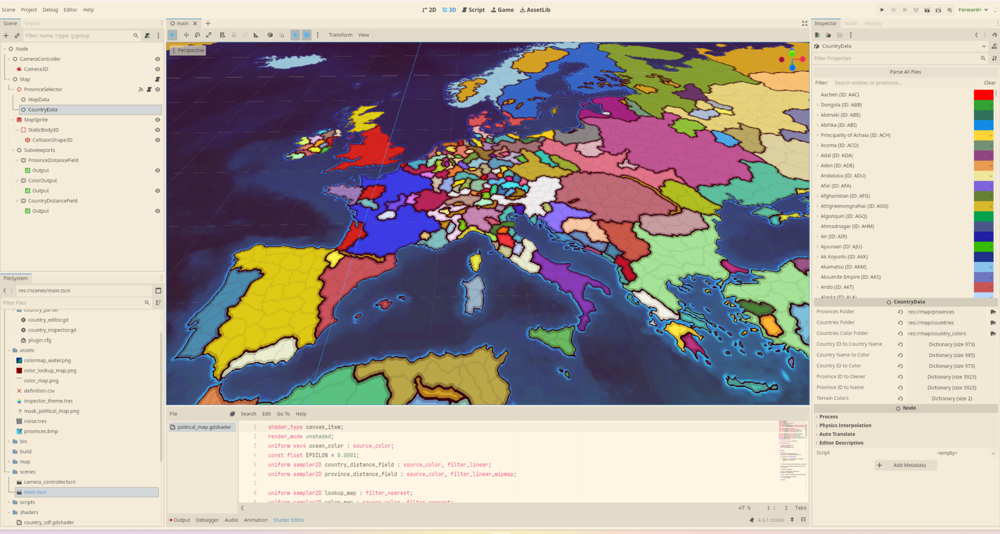

# Grand Strategy Map GDextension

GS Map is a Godot 4.5 GDExtension that provides editor tools for interacting with Europa Universalis provinces and country data as well as a shader pipeline that renders a map with smooth borders.

## Features

- Smooth borders using HQX shader
- Compute abstraction for generating `color_map`, `lookup_color` and `political_mask`
- Export/import functionality based on Europa Universalis 4 format
- Custom Inspector window for editing country data

## Minimal Demo Example using Gdscript with Borders

In the `main.tscn` scene you can see how to use the custom nodes:

[🎮 Play on Itch.io ](https://tycro-dev.itch.io/grand-strategy-map-demo)

Arrow keys to move the camera
Middle mouse to zoom in or out
Ctrl + Click will select a country
Click will change ownership between the province clicked and the selected country if there is one

## Minimal Political Map
In the scenes folder `simple_political_map.tscn`, there is a similar demo as the previous one, but without any border rendering.

## Blog post
You can read a blog post on the basics of map rendering [here](https://tycro-games.github.io/posts/Grand-Strategy-Editor-using-Gdextension-in-Godot-with-C++/).

## References

The intel [paper](https://www.intel.com/content/dam/develop/external/us/en/documents/optimized-gradient-border-rendering-in-imperator-rome.pdf) describing the shader techniques.
I found the HQX shader to godot in this [repo](https://github.com/Thomas-Holtvedt/opengs/blob/8a86111d108fe3bcaef8c827529978e84ff8131c/map/shaders/map3d.gdshader).
